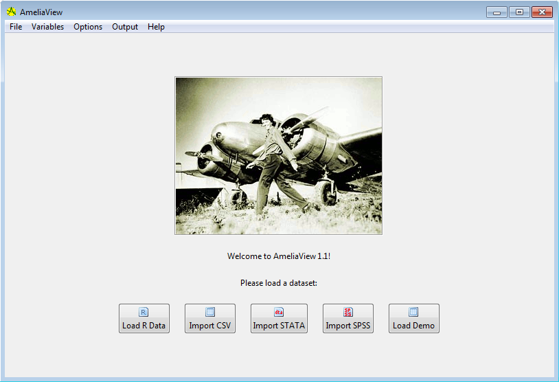
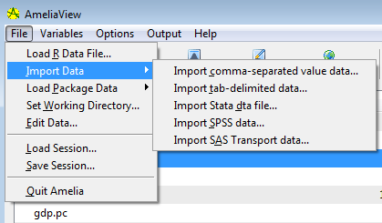
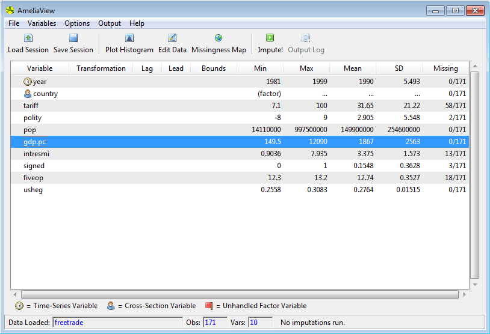
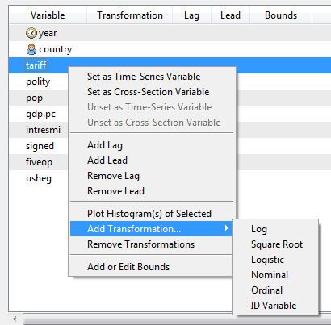
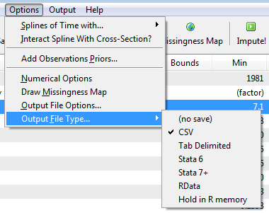
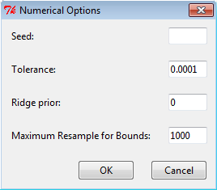
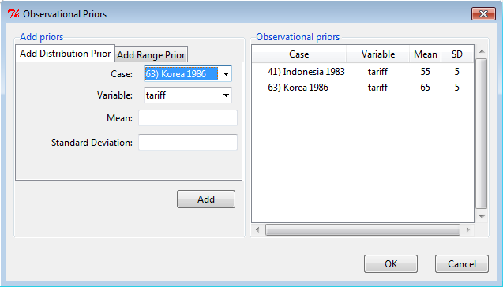
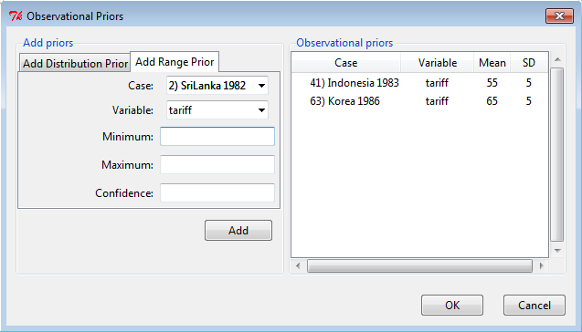
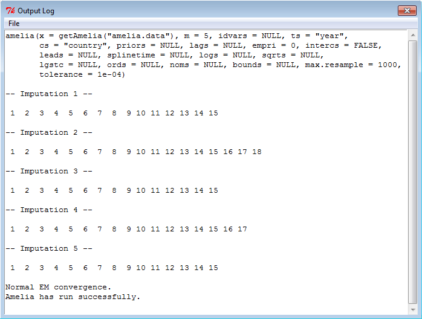
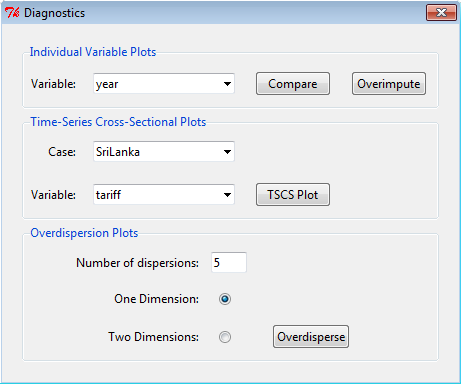

```{r setup, echo = FALSE, include = FALSE}
knitr::opts_chunk$set(fig.width = 5, fig.height = 4, fig.align = "center")
options(digits = 4, show.signif.stars = FALSE)
set.seed(12345)
```

Below is a guide to the AmeliaView menus with references back to the users's guide. The same principles from the user's guide apply to AmeliaView. The only difference is how you interact with the program. Whether you use the GUI or the command line versions, the same underlying code is being called, and so you can read the command line-oriented discussion above even if you intend to use the GUI.


## Loading AmeliaView

The easiest way to load AmeliaView is to open an R session and type the following two commands:


```{r load_av, eval = FALSE}
library(Amelia)
AmeliaView()
```

This will bring up the AmeliaView window on any platform.





## Loading data into AmeliaView

AmeliaView loads with a welcome screen that has buttons which can load a data in many of the common formats. Each of these will bring up a window for choosing your dataset. Note that these buttons are only a subset of the possible ways to load data in AmeliaView. Under the File menu (shown below), you will find more options, including the datasets included in the package (`africa` and `freetrade`). You will also find import commands for Comma-Separated Values (.CSV), Tab-Delimited Text (.TXT), Stata v.5-10 (.DTA), SPSS (.DAT), and SAS Transport (.XPORT). Note that when using a CSV file, Amelia assumes that your file has a header (that is, a row at the top of the data indicating the variable names).




You can also load data from an RData file. If the RData file contains more than one `data.frame`, a pop-up window will ask to you find the dataset you would like to load. In the file menu, you can also change the underlying working directory. This is where AmeliaView will look for data by default and where it will save imputed datasets.


## Variable Dashboard



Once a dataset is loaded, AmeliaView will show the variable dashboard. In this mode, you will see a table of variables, with the current options for each of them shown, along with a few summary statistics. You can reorder this table by any of these columns by clicking on the column headings. This might be helpful to, say, order the variables by mean or amount of missingness.




You can set options for individual variables by the right-click context menu or through the "Variables" menu. For instance, clicking "Set as Time-Series Variable" will set the currently selected variable in the dashboard as the time-series variable. Certain options are disabled until other options are enabled. For instance, you cannot add a lagged variable to the imputation until you have set the time-series variable. Note that any `factor` in the data is marked as a ID variable by default, since a `factor` cannot be included in the imputation without being set as an ID variable, a nominal variable, or the cross-section variable. If there is a `factor` that fails to meet one of these conditions, a red flag will appear next to the variable name.


1. **Set as Time-Series Variable** - Sets the currently selected variable to the time-series variable. Disabled when more than one variable is selected. Once this is set, you can add lags and leads and add splines of time. The time-series variable will have a clock icon next to it.
2. **Set as Cross-Section Variable** - Sets the currently selected variable to the cross-section variable. Disabled when more than one variable is selected. Once this is set, you can interact the splines of time with the cross-section. The cross-section variable will have a person icon next to it.
3. **Unset as Time-Series Variable** - Removes the time-series status of the variable. This will remove any lags, leads, or splines of time.
4. **Unset as Cross-Section Variable** - Removes the cross-section status of the variable. This will remove any intersection of the splines of time and the cross-section.
5. **Add Lag/Lead** - Adds versions of the selected variables either lagged back ("lag") or forward ("lead").
6. **Remove Lag/Lead** - Removes any lags or leads on the selected variables.
7. **Plot Histogram of Selected** - Plots a histogram of the selected variables. This command will attempt to put all of the histograms on one page, but if more than nine histograms are requested, they will appear on multiple pages.
8. **Add Transformation...** - Adds a transformation setting for the selected variables. Note that each variable can only have one transformation and the time-series and cross-section variables cannot be transformed.
9. **Remove Transformation** - Removes any transformation for the selected variables.
10. **Add or Edit Bounds** - Opens a dialog box to set logical bounds for the selected variable. 


## Amelia Options





The "Variable" menu and the variable dashboard are the place to set variable-level options, but global options are set in the "Options" menu. For more information on these options, see `vignette("using-amelia")`.

1. **Splines of Time with...** - This option, if activated, will have Ameliause flexible trends of time with the specified number of knots in the imputation. The higher the number of knots the greater the variation in the trend structure, yet it will take more degrees of freedom to estimate. 
2. **Interact with Cross-Section?** - Include and interaction of the cross-section with the time trends. This interaction is way of allowing the trend of time to vary across cases as well. Using a 0-level spline of time and interacting with the cross section is the equivalent of using a fixed effects. 
3. **Add Observational Priors...** - Brings a dialog window to set prior beliefs about ranges for individual missing observations.
4. **Numerical Options** - Brings a dialog window to set the tolerance of the EM algorithm, the seed of the random number generator, the ridge prior for numerical stability, and the maximum number of redraws for the logical bounds.
5. **Draw Missingness Map** - Draws a missingness map. 
6. **Output File Options** - Bring a dialog to set the stub of the prefix of the imputed data files and the number of imputations. If you set the prefix to `mydata`, your output files will be `mydata1.csv, mydata2.csv...` etc.
7. **Output File Type** - Sets the format of imputed data. If you would like to not save any output data sets (if you wanted, for instance, to simply look at diagnostics), set this option to "(no save)." Currently, you can save the output data as: Comma Separated Values (.CSV), Tab Delimited Text (.TXT), Stata (.DTA), R save object (.RData), or to hold it in R memory. This last option will only work if you have called AmeliaView from an R session and want to return to the R command line to work with the output. Its name in R workspace will be the file prefix. The stacked version of the Stata output will work with their built-in `mi` tools.

### Numerical options




1. **Seed** - Sets the seed for the random number generator
  used by Amelia. Useful if you need to have the same output twice.

1. **Tolerance** - Adjust the level of tolerance that Amelia
  uses to check convergence of the EM algorithm.  In very large
  datasets, if your imputation chains run a long time without
  converging, increasing the tolerance will allow a lower threshold to
  judge convergence and end chains after fewer iterations.

1. **Empirical Prior** - A prior that adds observations to
  your data in order to shrink the covariances.  A useful place to
  start is around 0.5\% of the total number of observations in the
  dataset.

1. **Maximum Resample for Bounds** - Amelia fits logical bounds by
  rejecting any draws that do not fall within the bounds. This value
  sets the number of times Amelia should attempt to resample to fit
  the bounds before setting the imputation to the bound.

### Add Distributional Prior




1. **Current Priors** - A table of current priors in distributional
  form, with the variable and case name. You can remove priors by
  selecting them and using the right-click context menu.
1. **Case** - Select the case name or number you wish to set
  the prior about.  You can also choose to make the prior for the
  entire variable, which will set the prior for any missing cell in
  that variable.  The case names are generated from the row name of
  the observation, the value of the cross-section variable of the
  observation and the value of the time series variable of the
  observation.
1. **Variable** - The variable associated with the prior you would like
  specify.  The list provided only shows the missing variables for the currently
  selected observation.
1.**Mean** - The mean value of the prior. The textbox will not accept
  letters or out of place punctuation.
1. **Standard Deviation** - The standard deviation of the prior.  The
  textbox will only accept positive non-zero values.


### Add Range Prior




1. **Case** - Select the case name or number you wish to set
  the prior about. You can also choose to make the prior for the
  entire variable, which will set the prior for any missing cell in
  that variable.  The case names are generated from the row name of
  the observation, the value of the cross-section variable of the
  observation and the value of the time series variable of the
  observation.
1. **Variable** - The variable associated with the prior you would like
  specify.  The list provided only shows the missing variables for the currently
  selected observation.
1. **Minimum** - The minimum value of the prior. The textbox will not accept
  letters or out of place punctuation.
1. **Maximum** - The maximum value of the prior. The textbox will not accept
  letters or out of place punctuation.
1. **Confidence** - The confidence level of the prior.  This should be
  between 0 and 1, non-inclusive.  This value represents how certain your priors
  are.  This value cannot be 1, even if you are absolutely certain of a give
  range.  This is used to convert the range into an appropriate distributional
  prior.


## Imputing and checking diagnostics




Once you have set all the relevant options, you can impute your data by clicking the "Impute!" button in the toolbar. In the bottom right corner of the window, you will see a progress bar that indicates the progress of the imputations. For large datasets this could take some time. Once the imputations are complete, you should see a "Successful Imputation!" message appear where the progress bar was. You can click on this message to open the folder containing the imputed datasets.

If there was an error during the imputation, the output log will pop-up and give you the error message along with some information about how to fix the problem. Once you have fixed the problem, simply click "Impute!" again. Even if there was no error, you may want to view the output log to see how Ameliaran. To do so, simply click the "Show Output Log" button. The log also shows the call to the `amelia()` function in R. You can use this code snippet to run the same imputation from the R command line. You will have to replace the `x` argument in the `amelia()` call to the name of you dataset in the R session.


### Diagnostics Dialog




Upon the successful completion of an imputation, the diagnostics menu will become available. Here you can use all of the diagnostics available at the command-line.

1. **Compare Plots** - This will display the relative
  densities of the observed (red) and imputed (black) data.  The
  density of the imputed values are the average imputations across all
  of the imputed datasets.
1. **Overimpute** - This will run Ameliaon the full data
  with one cell of the chosen variable artificially set to missing and
  then check the result of that imputation against the truth.  The
  resulting plot will plot average imputations against true values
  along with 90% confidence intervals.  These are plotted over a
  $y=x$ line for visual inspection of the imputation model.
1. **Number of overdispersions** - When running the
  overdispersion diagnostic, you need to run the imputation algorithm
  from several overdispersed starting points in order to get a clear
  idea of how the chain are converging.  Enter the number of
  imputations here.
1. **Number of dimensions** - The overdispersion diagnostic
  must reduce the dimensionality of the paths of the imputation
  algorithm to either one or two dimensions due to graphical
  restraints.
1. **Overdisperse** - Run overdispersion diagnostic to
  visually inspect the convergence of the Amelia algorithm from
  multiple start values that are drawn randomly.


## Sessions

It is often useful to save a session of AmeliaView to save time if you have impute the same data again. Using the **Save Session** button will do just that, saving all of the current settings (including the original and any imputed data) to an RData file. You can then reload your session, on the same computer or any other, simply by clicking the **Load Session** button and finding the relevant RData file. All of the settings will be restored, including any completed imputations. Thus, if you save the session after imputing, you can always load up those imputations and view their diagnostics using the sessions feature of AmeliaView.


